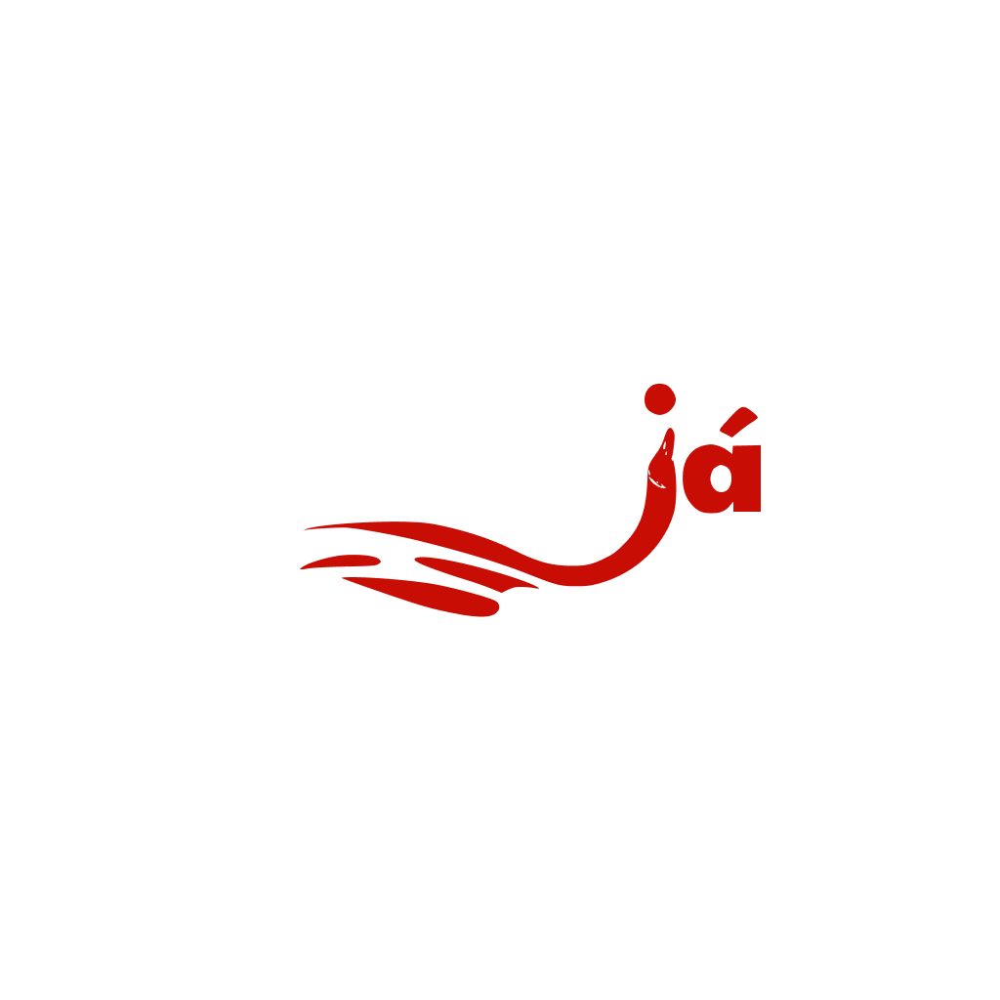

<p align="center">
  
</p>


# Rango-Ja

Rango é uma plataforma web que otimiza a conexão entre restaurantes e clientes. Permite aos usuários explorar cardápios e fazer pedidos online de forma intuitiva, enquanto oferece aos restaurantes parceiros um sistema eficiente para registrar e gerenciar seus pedidos, atualizando cardápios e acompanhando operações em tempo real.

<p align="left">
  <a href="#sobre-o-projeto">Sobre o Projeto</a> •
  <a href="#funcionalidades">Funcionalidades</a> •
  <a href="#tecnologias-utilizadas">Tecnologias</a> •
  <a href="#como-executar-o-projeto-para-desenvolvedores">Como Executar</a> •
  <a href="#screenshots">Screenshots</a> •
  <a href="#licença">Licença</a> •
  <a href="#contribuição">Contribuição</a> •
  <a href="#autor">Autor</a>
</p>

## Sobre o Projeto
- **Rango-Ja**: é uma plataforma web inovadora desenvolvida para otimizar a experiência de pedido de comida tanto para clientes quanto para restaurantes.

- **Para clientes**: oferecemos uma interface intuitiva para explorar uma vasta seleção de cardápios, personalizar e realizar pedidos com facilidade, além de acompanhar o status da entrega em tempo real.

- **Para restaurantes parceiros**: o Rango-Ja fornece um sistema robusto para registrar e gerenciar pedidos de forma eficiente, mantendo cardápios atualizados e monitorando suas operações em tempo real, impulsionando a organização e as vendas.

## Funcionalidades

**Para Restaurantes:**
- Cadastro e gerenciamento de cardápios.
- Recebimento e atualização de pedidos em tempo real.
- Acompanhamento de operações e estatísticas.

**Para Clientes:**
- Exploração de cardápios e realização de pedidos.
- Acompanhamento de status de pedidos.
- Avaliação de restaurantes e cardápios.
- Notificações em tempo real.

### Tecnologias Utilizadas

* 
*  
* 
* 
* 


## Como Executar o Projeto (Para Desenvolvedores)

### Pré-requisitos

- #### **Node.js**

  * **O que é:** É o ambiente de execução JavaScript que você usará para o seu backend (com Express) e para gerenciar as dependências do seu projeto (tanto frontend quanto backend).
  * **Versão recomendada:** Sempre é bom especificar uma versão LTS (Long Term Support) para garantir compatibilidade, por exemplo, `18.x` ou `20.x`.
  * **Onde baixar:** [nodejs.org/pt-br/download](https://nodejs.org/pt-br/download/)

- #### **npm**

  * **O que é:** É o gerenciador de pacotes padrão do Node.js. Ele é usado para instalar e gerenciar as dependências do seu projeto.
  * **Onde baixar:** [npm.com](https://www.npmjs.com/)


### Passo a passo

1. Clone o repositório

2. Instale as dependências Tanto para o frontend quanto para o backend.
   ```bash
   cd frontend && npm install
    ```
   ```bash
   cd backend && npm install
   ```

3. Inicie os Servidores do front e do backend separadamente.
   ```bash
   cd frontend && npm run dev
   ```
   ```bash
   cd backend && npm run dev
   ```
4. Acesse o projeto em seu navegador em    ``` http://localhost:3000    ```


## Screenshots

> Ir adicionando Futuramente ao longo do Desenvolvimento do app.


## Contribuição
Contribuições são bem-vindas! Se você deseja contribuir para o projeto, siga estas etapas:
1. Faça um fork do repositório.
2. Crie uma branch para sua feature ou correção de bug: `git checkout -b minha-feature`.
3. Faça as alterações desejadas e faça commit das suas alterações: `git commit -m 'Adiciona nova feature'`.
4. Envie suas alterações para o repositório remoto: `git push origin minha-feature`.
5. Abra um Pull Request neste repositório.


### Autor

<p align="center">
  <a href="https://github.com/SantiaGhou">
    
  </a>
</p>

<p align="center"><b>Filipe Santiago</b></p>
<p align="center">
  <a href="mailto:filipecacule@gmail.com">Email</a>
</p>

# Licença

<p>
  <a href="https://opensource.org/licenses/MIT">
    
  </a>
</p>

MIT License - Veja o arquivo [LICENSE](LICENSE) para mais detalhes.
